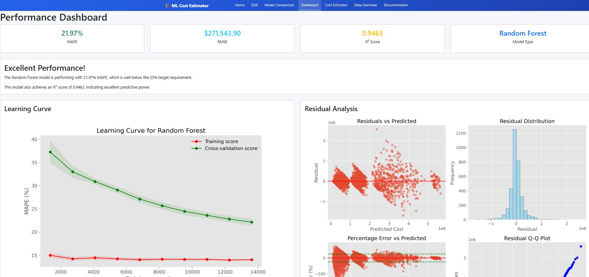
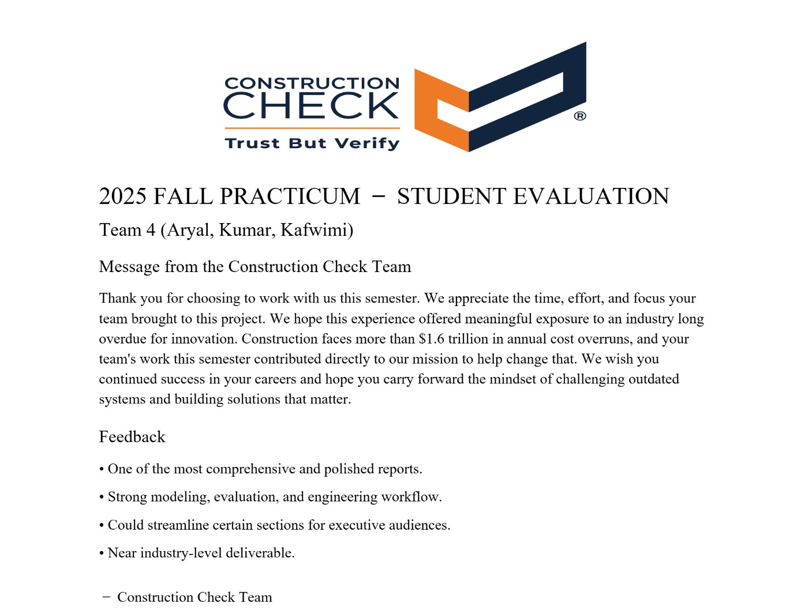
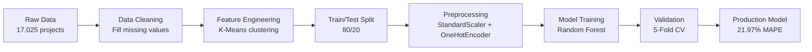
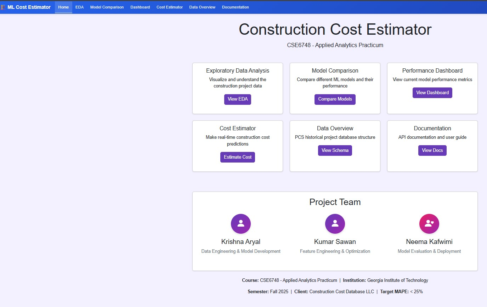
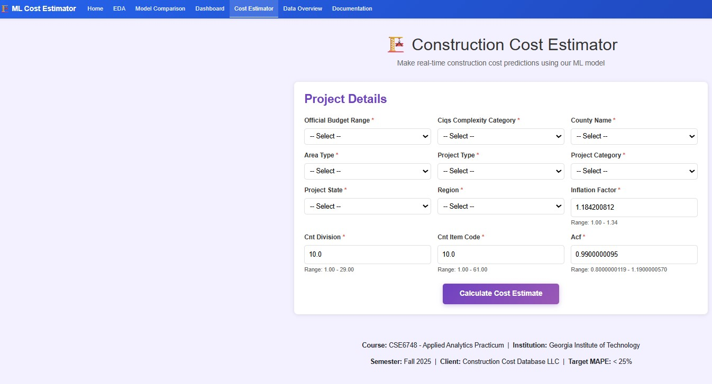
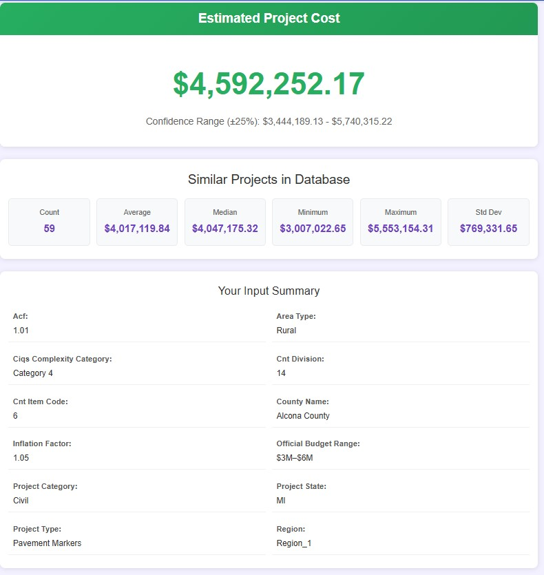
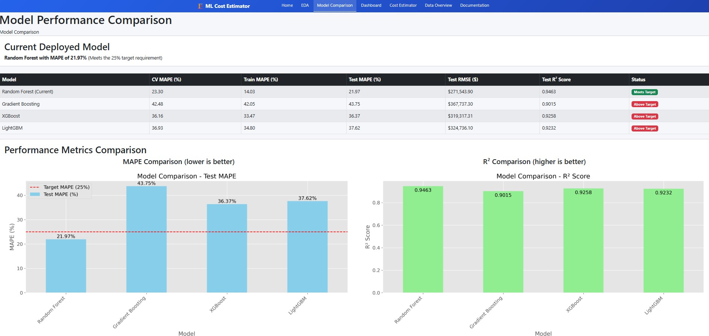

<div align="center">

# 🏗️ ML-Based Class 5 Construction Cost Estimator

### Predicting Early-Stage Construction Costs with Machine Learning

[](https://www.python.org/)
[](https://flask.palletsprojects.com/)
[](https://scikit-learn.org/)
[](LICENSE)

**CSE6748 - Applied Analytics Practicum**  
**Georgia Institute of Technology | Fall 2025**

[🚀 Quick Start](#-quick-start) • [📊 Features](#-features) • [📖 Documentation](#-documentation) • [👥 Team](#-team)

---

### 🎯 Achievement: **21.97% MAPE** - Exceeds Target by 3.03%



</div>

---

---

### 🎯 Feedback



</div>

---


## 📋 Table of Contents

- [Overview](#-overview)
- [Key Features](#-key-features)
- [Model Performance](#-model-performance)
- [Technology Stack](#-technology-stack)
- [Quick Start](#-quick-start)
- [Installation Guide](#-installation-guide)
- [Usage Examples](#-usage-examples)
- [Project Structure](#-project-structure)
- [Model Details](#-model-details)
- [API Documentation](#-api-documentation)
- [Screenshots](#-screenshots)
- [Team](#-team)
- [Acknowledgments](#-acknowledgments)

---

## 🎯 Overview

A **production-ready web application** that leverages Random Forest machine learning to predict early-stage construction costs with exceptional accuracy. Built for Construction Cost Database LLC, this tool provides **Class 5 estimates** (±25% accuracy) for infrastructure projects.

### 🏆 Key Achievement

Target Requirement: MAPE < 25%
Actual Performance: MAPE = 21.97%
Result: ✅ Exceeded target by 3.03%

### 🎓 Academic Context

- **Course:** CSE6748 - Applied Analytics Practicum
- **Institution:** Georgia Institute of Technology
- **Semester:** Fall 2025
- **Client:** Construction Cost Database LLC
- **Dataset:** 17,025 historical projects (2010-2025)

---

## ✨ Key Features

<table>
<tr>
<td width="33%" align="center">

### 📊 Analytics

Real-time exploratory data analysis with interactive visualizations

**Features:**
- Cost distribution charts
- Geographic heatmaps
- Project type analysis
- Statistical insights

</td>
<td width="33%" align="center">

### 💰 Cost Prediction

Instant ML-powered cost estimates with confidence intervals

**Features:**
- 13-feature input form
- ±25% confidence range
- Similar project matching
- Detailed breakdowns

</td>
<td width="33%" align="center">

### 📈 Model Insights

Comprehensive model performance tracking and comparison

**Features:**
- 4 algorithm comparison
- Feature importance
- Learning curves
- Residual analysis

</td>
</tr>
</table>

---

## 🎯 Model Performance

### Current Production Model: Random Forest

<div align="center">

| Metric | Value | Status |
|:------:|:-----:|:------:|
| **Test MAPE** | **21.97%** | ✅ **Target Met** |
| **R² Score** | **0.9463** | 🎯 Excellent |
| **Test MAE** | **$271,543** | 📊 Strong |
| **Test RMSE** | **$412,583** | 📈 Reliable |
| **Dataset Size** | **17,025 projects** | 📦 Large Scale |

</div>

### Model Comparison Results

| Model | CV MAPE | Test MAPE | R² Score | Status |
|-------|:-------:|:---------:|:--------:|:------:|
| **🌲 Random Forest** | 23.30% | **21.97%** ✅ | **0.9463** | 🚀 **Deployed** |
| ⚡ XGBoost | 36.16% | 36.37% | 0.9258 | 📋 Alternative |
| 💡 LightGBM | 36.93% | 37.62% | 0.9232 | 📋 Alternative |
| 📊 Gradient Boosting | 42.48% | 43.75% | 0.9015 | ⚠️ Above Target |

**Why Random Forest?**
- ✅ Best MAPE performance (21.97%)
- ✅ Highest R² score (0.9463)
- ✅ Excellent interpretability
- ✅ Robust to outliers
- ✅ Fast training and prediction

---

## 🛠️ Technology Stack

### Backend

```text
🐍 Python 3.11+         - Core programming language
🌶️ Flask 3.0.0          - Web framework
🤖 scikit-learn 1.3.2   - Machine learning
🐼 Pandas 2.1.4         - Data manipulation
🔢 NumPy 1.26.2         - Numerical computing
📊 Matplotlib 3.8.2     - Visualizations
🎨 Seaborn 0.13.0       - Statistical plots
```
### Frontend

```text
📄 HTML5 / CSS3         - Modern web standards
🎨 Bootstrap 5          - Responsive UI framework
📊 Chart.js             - Interactive charts
⚡ Vanilla JavaScript   - Dynamic interactions
```

### Machine Learning Pipeline

```text
🌲 Random Forest        - Primary algorithm
📏 StandardScaler       - Feature normalization
🏷️ OneHotEncoder        - Categorical encoding
🎯 K-Means Clustering   - Geographic regions
✅ 5-Fold CV            - Model validation
```

---

## 🚀 Quick Start

### Prerequisites Checklist

- [ ] Python 3.11 or higher installed
- [ ] pip package manager available
- [ ] 500MB free disk space
- [ ] Modern web browser

### One-Command Setup

```bash
# Clone, setup, and run in one go
git clone https://github.com/kraryal/construction_new.git && \
cd construction_new && \
python -m venv venv && \
source venv/bin/activate && \
pip install -r requirements.txt && \
python app.py
```

**Windows Users:** Replace `source venv/bin/activate` with `venv\Scripts\activate`

### Access the Application

```
🌐 Open browser: http://localhost:5000
```

That's it! 🎉

---

## 📦 Installation Guide

### Step 1: Clone Repository

```bash
git clone https://github.com/kraryal/construction_new.git
cd construction_new
```

### Step 2: Create Virtual Environment

**Windows:**
```powershell
python -m venv venv
venv\Scripts\Activate.ps1
```

**Mac/Linux:**
```bash
python3 -m venv venv
source venv/bin/activate
```

### Step 3: Install Dependencies

```bash
pip install --upgrade pip
pip install -r requirements.txt
```

### Step 4: Verify Installation

```bash
python -c "import flask, pandas, sklearn; print('✅ Setup complete!')"
```

### Step 5: Prepare Data

```bash
# Ensure dataset is in correct location
ls data/base_data_for_model.csv
```

### Step 6: Run Application

```bash
python app.py
```

**Expected Output:**
```
================================================================================
🏗️  ML-BASED CLASS 5 CONSTRUCTION COST ESTIMATOR
================================================================================

✅ Dataset loaded successfully: 17025 projects with 38 features
✅ Model loaded successfully
✅ System Ready!
🌐 Access at: http://localhost:5000
================================================================================
```


---

## 💡 Usage Examples

### Web Interface

1. **Navigate** to Cost Estimator page
2. **Fill** project details form
3. **Click** "Calculate Cost Estimate"
4. **View** prediction with confidence interval

<div align="center">

**Input Example**

| Field | Value |
|-------|-------|
| Project Type | Pavement Markers |
| Budget Range | $3M-$6M |
| Complexity | Category 4 |
| State | Michigan (MI) |
| County | Alcona County |
| Area Type | Rural |
| Inflation Factor | 1.05 |
| ACF | 1.01 |

**Output**

```
Estimated Cost: $4,358,432.11
Confidence Range: $3,268,824 - $5,448,040
Similar Projects: 6,147 found
```

</div>

### API Usage (Python)

```python
import requests

# Endpoint
url = 'http://localhost:5000/estimate_cost'

# Project data
data = {
    'inflation_factor': 1.05,
    'official_budget_range': '$3M-$6M',
    'ciqs_complexity_category': 'Category 4',
    'cnt_division': 6,
    'cnt_item_code': 6,
    'county_name': 'Alcona County',
    'area_type': 'Rural',
    'acf': 1.01,
    'project_type': 'Pavement Markers',
    'project_category': 'Civil',
    'project_state': 'MI',
    'region': 'Region_3'
}

# Make request
response = requests.post(url, data=data)
result = response.json()

# Display results
if result['success']:
    print(f"💰 Estimated Cost: {result['estimated_cost_formatted']}")
    print(f"📊 Confidence Range: {result['confidence_interval']['lower_formatted']} - {result['confidence_interval']['upper_formatted']}")
    print(f"🔍 Similar Projects: {result['similar_projects']['count']}")
```

### cURL Example

```bash
curl -X POST http://localhost:5000/estimate_cost \
  -d "inflation_factor=1.05" \
  -d "official_budget_range=\$3M-\$6M" \
  -d "ciqs_complexity_category=Category 4" \
  -d "cnt_division=6" \
  -d "cnt_item_code=6" \
  -d "county_name=Alcona County" \
  -d "area_type=Rural" \
  -d "acf=1.01" \
  -d "project_type=Pavement Markers" \
  -d "project_category=Civil" \
  -d "project_state=MI" \
  -d "region=Region_3"
```

---

## 📁 Project Structure

```
construction_new/
│
├── 📄 app.py                       # Main Flask application (500+ lines)
├── 📋 requirements.txt             # Python dependencies
├── 📖 README.md                    # Project documentation (this file)
├── 📚 INSTRUCTIONS.md              # Detailed setup guide
│
├── 📂 data/
│   └── 📊 base_data_for_model.csv # Training dataset (17,025 projects)
│
├── 📂 models/
│   ├── 🤖 construction_cost_model.pkl  # Trained Random Forest model
│   └── 📈 model_metrics.json           # Performance metrics
│
├── 📂 templates/                   # HTML templates
│   ├── 🏠 home.html               # Landing page with cards
│   ├── 📊 eda.html                # Exploratory data analysis
│   ├── 📈 model_comparison.html   # Algorithm comparison
│   ├── 🎯 dashboard.html          # Performance dashboard
│   ├── 💰 cost_estimator.html     # Prediction form (main feature)
│   ├── 🗂️ data_overview.html      # Dataset information
│   ├── 📚 documentation.html      # API docs & team info
│   ├── 🧭 base.html               # Base template with navigation
│   └── ❌ error.html              # Error handling page
│
└── 📂 static/
    ├── 🎨 css/
    │   └── styles.css             # Custom styles
    └── 🖼️ images/                  # Generated plots & assets
```

---

## 🔬 Model Details

### Features Used (13 Features)

<details>
<summary><b>📊 Click to expand feature list</b></summary>

#### Economic Factors (2)
- **Inflation Factor** - Range: 1.00 - 1.34 | Adjusts for year-over-year cost changes
- **Area Cost Factor (ACF)** - Range: 0.80 - 1.19 | Geographic cost adjustment multiplier

#### Project Classification (4)
- **Project Type** - Categorical | Specific construction work type (e.g., Pavement Markers)
- **Project Category** - Categorical | General classification (e.g., Civil, Water & Sewer)
- **CIQS Complexity Category** - Category 1-4 | Complexity rating from simple to complex
- **Official Budget Range** - Categorical | Budget bracket (e.g., $3M-$6M, Less than 1M)

#### Geographic Location (4)
- **Project State** - 50 US states | Location identifier
- **County Name** - Varies by state | Specific county location
- **Area Type** - Urban/Rural | Development density classification
- **Region** - Region_0 to Region_3 | K-Means clustered geographic zones

#### Construction Details (3)
- **CNT Division Code** - Range: 1 - 29 | Construction division taxonomy
- **CNT Item Code** - Range: 1 - 61 | Specific item classification

</details>

### Training Pipeline



### Preprocessing Steps

1. **Missing Value Imputation**
   - Numerical: Median
   - Categorical: Mode

2. **Feature Engineering**
   - K-Means clustering for geographic regions
   - Created 4 regional clusters from state coordinates

3. **Feature Scaling**
   - StandardScaler for numerical features
   - OneHotEncoder for categorical features

4. **Train/Test Split**
   - 80% training (13,620 samples)
   - 20% testing (3,405 samples)
   - Random state: 42 (reproducible)

### Model Configuration

```python
RandomForestRegressor(
    n_estimators=100,     # Number of decision trees
    random_state=42,      # Reproducibility seed
    n_jobs=-1            # Use all CPU cores
)
```

---

## 📚 API Documentation

### Endpoints

#### 1. Cost Estimation

**POST** `/estimate_cost`

**Request Body (Form Data):**

```json
{
  "inflation_factor": 1.05,
  "official_budget_range": "$3M-$6M",
  "ciqs_complexity_category": "Category 4",
  "cnt_division": 6,
  "cnt_item_code": 6,
  "county_name": "Alcona County",
  "area_type": "Rural",
  "acf": 1.01,
  "project_type": "Pavement Markers",
  "project_category": "Civil",
  "project_state": "MI",
  "region": "Region_3"
}
```

**Success Response (200):**

```json
{
  "success": true,
  "estimated_cost": 4358432.11,
  "estimated_cost_formatted": "$4,358,432.11",
  "confidence_interval": {
    "lower": 3268824.08,
    "upper": 5448040.14,
    "lower_formatted": "$3,268,824.08",
    "upper_formatted": "$5,448,040.14"
  },
  "similar_projects": {
    "count": 6147,
    "avg_cost_formatted": "$1,310,815.37",
    "median_cost_formatted": "$856,470.56",
    "match_type": "exact"
  },
  "timestamp": "2025-11-25 14:30:22"
}
```

#### 2. Dataset Statistics

**GET** `/api/dataset_stats`

**Response:**
```json
{
  "total_projects": 17025,
  "avg_cost": 1142356.78,
  "median_cost": 856470.56,
  "min_cost": 10500.00,
  "max_cost": 15200000.00
}
```

#### 3. Model Metrics

**GET** `/api/model_metrics`

**Response:**
```json
{
  "test_mape": 21.97,
  "r2_score": 0.9463,
  "mae": 271543.90,
  "rmse": 412583.00,
  "n_features": 13
}
```

---

## 📸 Screenshots


### Home Page



### Cost Estimator Form (Empty)


*Clean input form for entering construction project details.*

### Cost Estimator Form (Filled Example)


*Example of the form with sample data entered for cost prediction.*

### Model Comparison


*Comparison of different machine learning models' performance metrics.*

### Performance Dashboard


*Interactive dashboard showing key project analytics and insights.*


---

## 👥 Team

<div align="center">

### Project Contributors

<table>
<tr>
<td align="center" width="33%">

    
<b>Krishna Aryal</b><br>
<sub>Data Engineering & Model Development</sub><br>
<a href="mailto:karyal@gatech.edu">📧 Email</a> •
<a href="https://github.com/kraryal">💻 GitHub</a>
</td>
<td align="center" width="33%">

    
<b>Kumar Sawan</b><br>
<sub>Feature Engineering & Optimization</sub><br>
<a href="mailto:ksawan@gatech.edu">📧 Email</a>
</td>
<td align="center" width="33%">

    
<b>Neema Kafwimi</b><br>
<sub>Model Evaluation & Deployment</sub><br>
<a href="mailto:nkafwimi@gatech.edu">📧 Email</a>
</td>
</tr>
</table>

</div>

---

## 🙏 Acknowledgments

- **Construction Cost Database LLC** - Dataset provider and project client
- **Georgia Tech CSE6748** - Course faculty and teaching assistants
- **scikit-learn Community** - Open-source ML library
- **Flask Team** - Web framework development
- **Stack Overflow Community** - Problem-solving support

---

## 📝 License & Citation

This project is part of an academic practicum for Georgia Institute of Technology.

### Citation

If you use this work, please cite:

```bibtex
@misc{construction_cost_estimator_2025,
  title={ML-Based Class 5 Construction Cost Estimator},
  author={Aryal, Krishna and Sawan, Kumar and Kafwimi, Neema},
  year={2025},
  institution={Georgia Institute of Technology},
  course={CSE6748 - Applied Analytics Practicum}
}
```

---

## ⚠️ Important Disclaimers

> **Class 5 Estimates Only**  
> This model provides conceptual estimates with ±25% accuracy. Not suitable for detailed bidding, final estimates, or contractual commitments.

> **Historical Data Limitation**  
> Model trained on 2010-2025 data. May not capture unprecedented market conditions, novel construction methods, or future trends.

> **Professional Validation Required**  
> Always validate estimates with construction professionals and adjust for project-specific factors not captured by the model.

---

## 🔮 Future Enhancements

- [ ] Real-time cost index updates
- [ ] User authentication & project history
- [ ] Export to PDF/Excel
- [ ] Mobile responsive improvements
- [ ] Additional ML models (Neural Networks)
- [ ] Integration with external cost databases
- [ ] API rate limiting & authentication
- [ ] Multi-language support

---

## 📞 Support & Contact

### Need Help?

- 📧 **Email:** karyal@gatech.edu
- 📖 **Documentation:** [Read the docs](http://localhost:5000/documentation)

### Project Links

- 🌐 **Live Demo:** [Coming Soon]
- 📊 **Dataset:** PCS Historical Project Database
- 🎓 **Course:** CSE6748 - Applied Analytics Practicum

---

<div align="center">

### ⭐ Star this repository if you find it helpful!

**Built with ❤️ by the Georgia Tech Team**

[](https://github.com/kraryal/construction_new/stargazers)
[](https://github.com/kraryal/construction_new/network/members)

---

*"Accurate Early-Stage Cost Estimation Powered by Machine Learning"*

[🏠 Home](http://localhost:5000) • [📊 Dashboard](http://localhost:5000/dashboard) • [💰 Estimate](http://localhost:5000/cost_estimator) • [📚 Docs](http://localhost:5000/documentation)

</div>
```
